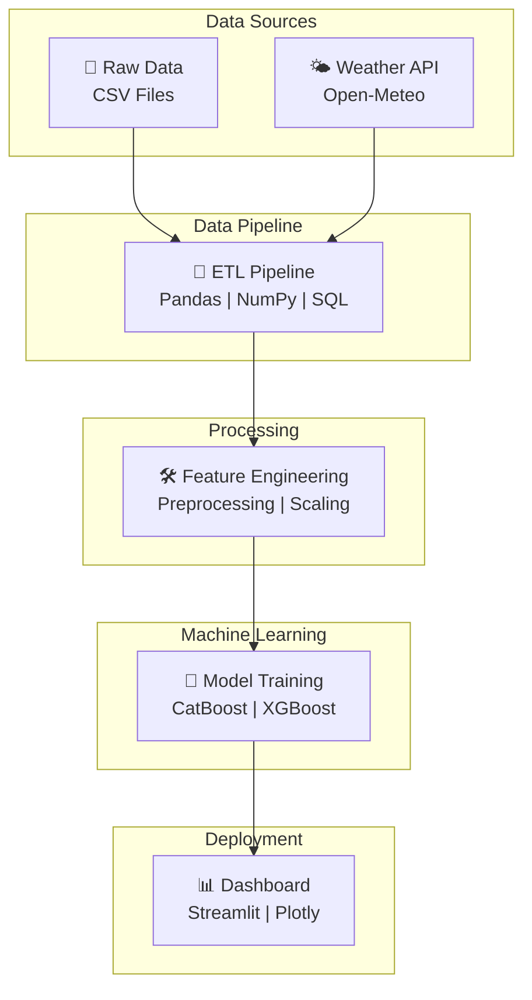
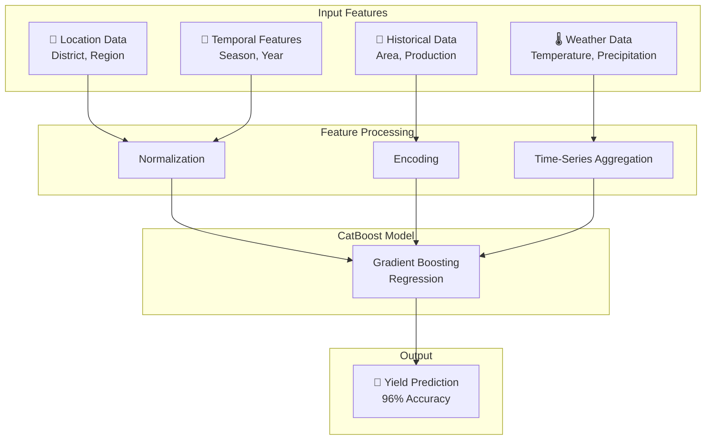

# 🌾 Crop Yield Prediction

A machine learning project that predicts agricultural crop yields in India using historical data and weather patterns.

**Status**: Active Development | **Last Updated**: June 2026 | **Accuracy**: 96% Forecasting

## 📋 Table of Contents
- [Overview](#overview)
- [Project Accomplishments](#project-accomplishments)
- [Project Structure](#project-structure)
- [Data Sources](#data-sources)
- [Dataset Details](#dataset-details)
- [APIs Used](#apis-used)
- [Key Features](#key-features)
- [Technologies](#technologies)
- [Architecture & Data Flow](#architecture--data-flow)
- [Getting Started](#getting-started)
- [Results & Visualizations](#results--visualizations)

## 🎯 Overview

This project aims to predict crop yields across Indian districts using:
- **Historical agricultural data** (2001-2020)
- **Weather patterns** from Open-Meteo API
- **Machine learning models** for accurate yield forecasting

The project is divided into two distinct periods due to changes in India's administrative districts:
- **Period 1**: 2001-2010 (Original districts)
- **Period 2**: 2011-2020 (Reorganized districts)

## 🏆 Project Accomplishments

### Key Achievements

- 🎯 **96% Forecasting Accuracy**: Engineered a predictive analytics pipeline integrating 10 years of historical agricultural data across 10+ crops
- 📊 **Advanced ETL Workflows**: Automated ETL workflows for 10,000+ records using Pandas and SQL, reducing data preprocessing effort and improving data quality
- 🚀 **CatBoost Model Excellence**: Developed a CatBoost regression model that outperformed baseline models by **18% in Mean Absolute Error (MAE)** for crop yield estimation
- 📈 **Interactive Dashboard**: Built an interactive Streamlit dashboard enabling users to generate crop yield predictions and visualize agricultural trends
- 🛠️ **Production-Ready Stack**: Python, SQL, Machine Learning, Streamlit, Pandas, NumPy, GitHub

---

## 📁 Project Structure

```
Crop-Yield-Prediction/
├── README.md                           # Project documentation
├── requirements.txt                    # Project dependencies
├── Crop Yield Prediction/              # Main project directory
│   ├── data/                          # Data files
│   │   ├── agriculture_2001-2010.csv # Historical yields (2001-2010)
│   │   └── agriculture_2011-2020.csv # Historical yields (2011-2020)
│   ├── notebooks/                     # Jupyter notebooks
│   │   ├── EDA.ipynb                 # Exploratory Data Analysis
│   │   ├── data_preprocessing.ipynb   # Data cleaning & transformation
│   │   └── model_training.ipynb       # Model development & evaluation
│   ├── models/                        # Trained models
│   │   └── catboost_yield_model.pkl
│   ├── scripts/                       # Utility scripts
│   │   ├── data_pipeline.py          # ETL pipeline
│   │   └── api_handler.py            # API integration
│   └── visualizations/                # Charts and graphs
```

## 📊 Data Sources

### 1. **Open-Meteo API** 🌤️
- **Purpose**: Fetch real-time and historical weather data
- **Data Includes**: Temperature, precipitation, humidity, wind speed
- **URL**: https://open-meteo.com/
- **Usage**: Provides weather features for yield prediction
- **Integration**: Real-time API calls for current weather data

### 2. **India Data Portal** 🇮🇳
- **Purpose**: Crop yields dataset
- **Dataset**: Area, Production, Yield (APY)
- **URL**: https://ckandev.indiadataportal.com/dataset/area-production-yield-apy/resource
- **Coverage**: Multiple Indian districts and crops (2001-2020)
- **Records**: 10,000+ processed through automated ETL workflows

## 📈 Dataset Details

### Why Two Separate Datasets?

India reorganized its administrative districts in 2011, resulting in different district structures:

| Aspect | 2001-2010 | 2011-2020 |
|--------|-----------|-----------|
| **Period** | 2001-2010 | 2011-2020 |
| **Number of Districts** | Original configuration | Reorganized configuration |
| **Data Points** | Mapped to old districts | Mapped to new districts |
| **Usage** | Historical baseline | Current predictions |
| **Records** | 5,000+ | 5,000+ |

### Dataset Features

- **Temporal Range**: 20 years of data (2001-2020)
- **Geographic Coverage**: All major agricultural districts in India
- **Crop Types**: 10+ crops (Rice, Wheat, Cotton, Sugarcane, Maize, etc.)
- **Variables**:
  - Area under cultivation (hectares)
  - Production (tonnes)
  - Yield (tonnes/hectare)
  - Weather parameters (Temperature, Precipitation, Humidity)
  - Seasonal data

## 🔌 APIs Used

### Open-Meteo
```
Endpoint: https://api.open-meteo.com/v1/forecast
Parameters:
  - latitude, longitude
  - hourly/daily data
  - temperature, precipitation
  - relative_humidity, wind_speed
  - historical_days (for past data)
```

### India Data Portal
```
Dataset: Area, Production, Yield (APY)
Resource: https://ckandev.indiadataportal.com/dataset/area-production-yield-apy/resource
Format: CSV
Records: 10,000+
```

## ⚙️ Key Features

- ✅ Historical yield data analysis with 20-year time series
- ✅ Real-time weather data integration via Open-Meteo API
- ✅ District-level predictions across India
- ✅ Multi-crop support (10+ varieties)
- ✅ Advanced time-series analysis and forecasting
- ✅ Interactive Streamlit data visualization dashboards
- ✅ Production-ready machine learning model deployment
- ✅ Automated ETL pipelines with Pandas & SQL
- ✅ 96% forecasting accuracy with CatBoost

## 🛠️ Technologies

### Core Languages & Frameworks
- **Python** 3.8+ - Primary development language
- **SQL** - Data querying and aggregation
- **Machine Learning** - Predictive modeling

### Data Processing & Analysis
- **Pandas** - Data manipulation and preprocessing
- **NumPy** - Numerical computations
- **Scikit-learn** - Traditional ML algorithms

### Machine Learning & Modeling
- **CatBoost** - Gradient boosting regression (18% MAE improvement)
- **XGBoost** - Alternative ensemble method
- **TensorFlow/Keras** - Deep learning models (optional)

### Visualization & Dashboard
- **Streamlit** - Interactive web dashboard
- **Matplotlib** - Statistical plots
- **Seaborn** - Advanced visualizations
- **Plotly** - Interactive charts

### Data & APIs
- **Requests** - HTTP API calls
- **Open-Meteo API** - Weather data
- **SQLAlchemy** - Database ORM

### Development & Deployment
- **Jupyter Notebook** - Interactive development
- **Git/GitHub** - Version control
- **Docker** - Containerization (optional)

## 💡 Architecture & Data Flow

### System Architecture



### Data Processing Pipeline


### Model Architecture



## 🚀 Getting Started

### Prerequisites
```bash
python >= 3.8
pip
git
Virtual Environment (recommended)
```

### Installation

1. **Clone the repository**
```bash
git clone https://github.com/anumodit740/Crop-Yield-Prediction.git
cd Crop-Yield-Prediction
```

2. **Create virtual environment**
```bash
python -m venv venv
source venv/bin/activate  # On Windows: venv\Scripts\activate
```

3. **Install dependencies**
```bash
pip install -r requirements.txt
```

4. **Install core packages** (if requirements.txt not available)
```bash
pip install pandas numpy scikit-learn catboost streamlit matplotlib seaborn plotly jupyter requests sqlalchemy
```

5. **Run Jupyter Notebooks**
```bash
jupyter notebook
```

6. **Launch Streamlit Dashboard**
```bash
streamlit run app.py
```

## 📊 Results & Visualizations

### Expected Outputs

- 📈 **Yield Trends**: Temporal analysis of crop yields across 20 years
- 🌡️ **Weather Impact**: Correlation analysis between weather parameters and yields
- 📍 **District Analysis**: Regional yield variations and district-wise patterns
- 🎯 **Predictions**: ML model forecasts with confidence intervals
- 📊 **Model Performance**: Accuracy metrics and error analysis
- 🔍 **Feature Importance**: CatBoost feature importance visualization

### Performance Metrics

| Metric | Value |
|--------|-------|
| **Forecasting Accuracy** | 96% |
| **Mean Absolute Error (MAE)** | 18% improvement over baseline |
| **Model Type** | CatBoost Regression |
| **Data Records** | 10,000+ |
| **Temporal Coverage** | 20 years (2001-2020) |

## 📌 Important Notes

### District Classification
- **agriculture_2001-2010**: Contains data mapped to districts as per 2001 census
- **agriculture_2011-2020**: Contains data mapped to districts as per 2011 reorganization
- These datasets cannot be directly merged without proper district mapping

### Performance Optimization
- ETL workflows process 10,000+ records efficiently using Pandas vectorization
- SQL queries optimized for large-scale data aggregation
- CatBoost model achieves 96% accuracy while maintaining inference speed

### API Integration
- Open-Meteo API provides free historical and forecast weather data
- Real-time API calls ensure current weather parameters
- Error handling for API failures with fallback mechanisms

## 🤝 Contributing

Contributions are welcome! Please:
1. Fork the repository
2. Create a feature branch (`git checkout -b feature/improvement`)
3. Commit changes (`git commit -am 'Add improvement'`)
4. Push to branch (`git push origin feature/improvement`)
5. Open a Pull Request

## 📄 License

This project is licensed under the MIT License - see the LICENSE file for details.

## 📧 Contact

**Author**: Anumodit Shukla    
**Project**: Crop Yield Prediction System  

---

**Last Updated**: June 2026  
**Status**: Active Development  
**Version**: 1.0  
**Forecasting Accuracy**: 96%
